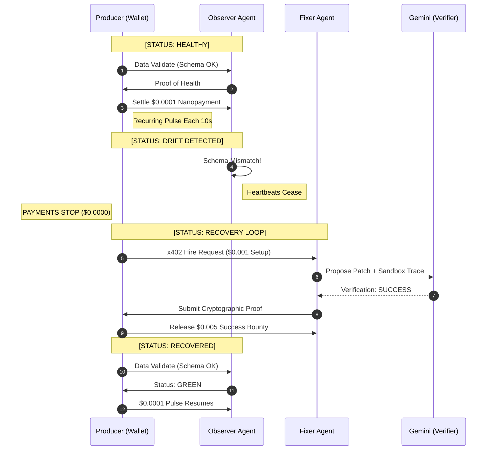

# 🚀 Arc Data Piper

**Arc Data Piper** is an autonomous, anti-fragile data infrastructure layer that replaces legacy "Subscription SaaS" with a **Pay-as-you-Heal** economic model. 

By leveraging **Circle Nanopayments** on the **Arc Blockchain**, Arc Data Piper ensures that financial settlement is directly tied to system integrity. You only pay for observability when your stream is healthy, and you only pay for repairs when outcome-based patches are verified.

---

## 💎 The Nanopayment Thesis

In traditional data infrastructure, you pay for "availability," yet you are billed even when data is broken or silent. Arc Data Piper flips the incentive: **The payment is the validation signal.**

### 1. The $0.0001 Pulse (Health Signal)
The Observer Agent validates your data stream every 10 seconds. 
*   **Green Signal:** If the data matches the schema, a **$0.0001 USDC** nanopayment is released.
*   **The Stop-Loss:** If schema drift is detected, the Observer immediately ceases validation. **The financial meter stops instantly.** You never pay for broken monitoring.

### 2. The $0.001 Fixer Fee & $0.005 Bounty (Outcome Signal)
Recovery is handled by the Fixer Agent, hired only when needed via **x402 (HTTP 402)**.
*   **Hire Fee ($0.001):** A one-time micro-payment to trigger log analysis and patch generation.
*   **Success Bounty ($0.005):** Escrow-gated. Released only after **Google Gemini** verifies the patch in a sandbox environment.
*   **Recovery:** Once verified, the heartbeat resumes, and the $0.0001 pulse starts again.

---

## 🔄 Billing Cycle & Fund Flow

The following diagram visualizes how the "rail" of funds responds to pipeline health in real-time.



---

## 📊 Economic Comparison

| Metric | Legacy SaaS Subscription | Arc Data Piper (Nanopayments) |
| :--- | :--- | :--- |
| **Billing Model** | Fixed Monthly / Tiered | Pay-as-you-Heal (Per 10s) |
| **Cost During Outage** | 100% (Sunk Cost) | **$0.00 (Automatic Stop-Loss)** |
| **Repair Incentive** | Reactive (Submit Ticket) | Proactive (Automated Bounty) |
| **Validation Fee** | Bundled / Opaque | $0.0001 per Heartbeat |
| **Healing Cost** | Fixed Support Cost | $0.001 Hire + $0.005 Success |

---

## 🛠️ Technology Stack

### **Settlement Layer**
*   **Circle Programmable Wallets:** Facilitating EIP-3009 nanopayments.
*   **Arc Blockchain (L1):** Sub-second finality for high-frequency M2M commerce.

### **Intelligence Layer**
*   **Google Gemini 2.5 Flash:** Grounded verification and patch generation for schema drifts.

### **Protocol Layer**
*   **x402 / HTTP 402:** Autonomous discovery and hiring of repair agents.
*   **Node.js / Ajv:** High-performance JSON Schema validation.

---

## 🚀 Getting Started

### 1. Prerequisites
*   Funded Circle Developer Account.
*   Arc Testnet Wallet (Producer & Agent roles).
*   Google Gemini API Key.

### 2. Installation
```bash
git clone https://github.com/shanyu/ArcDataPiper.git
cd ArcDataPiper
npm install
```

### 3. Environment Setup
```bash
cp .env.example .env
# Fill in:
# CIRCLE_API_KEY=...
# GEMINI_API_KEY=...
# ARC_WALLET_PRIVATE_KEY=...
```

### 4. Running the Piper
```bash
# Start the autonomous pipeline
npm run start:pipeline

# Manually trigger a drift to see the Stop-Loss in action
npm run trigger:drift
```
